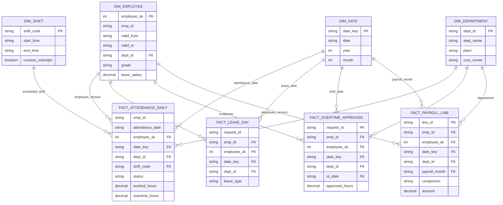

# Warehouse ER diagram

```mermaid
erDiagram
  DIM_EMPLOYEE ||--o{ FACT_ATTENDANCE_DAILY : employee_version
  DIM_DEPARTMENT ||--o{ FACT_ATTENDANCE_DAILY : department
  DIM_SHIFT ||--o{ FACT_ATTENDANCE_DAILY : scheduled_shift
  DIM_DATE ||--o{ FACT_ATTENDANCE_DAILY : attendance_date
  DIM_EMPLOYEE ||--o{ FACT_LEAVE_DAY : employee
  DIM_DATE ||--o{ FACT_LEAVE_DAY : leave_date
  DIM_EMPLOYEE ||--o{ FACT_OVERTIME_APPROVED : employee
  DIM_DATE ||--o{ FACT_OVERTIME_APPROVED : shift_date
  DIM_DEPARTMENT ||--o{ FACT_OVERTIME_APPROVED : department
  DIM_EMPLOYEE ||--o{ FACT_PAYROLL_LINE : employee_version
  DIM_DATE ||--o{ FACT_PAYROLL_LINE : payroll_month
  DIM_DEPARTMENT ||--o{ FACT_PAYROLL_LINE : department

  DIM_EMPLOYEE {
    int employee_sk PK
    string emp_id
    string valid_from
    string valid_to
    string dept_id FK
    string grade
    decimal basic_salary
  }
  DIM_DEPARTMENT {
    string dept_id PK
    string dept_name
    string plant
    string cost_center
  }
  DIM_SHIFT {
    string shift_code PK
    string start_time
    string end_time
    boolean crosses_midnight
  }
  DIM_DATE {
    string date_key PK
    string date
    int year
    int month
  }
  FACT_ATTENDANCE_DAILY {
    string emp_id
    string attendance_date
    int employee_sk FK
    string date_key FK
    string dept_id FK
    string shift_code FK
    string status
    decimal worked_hours
    decimal overtime_hours
  }
  FACT_LEAVE_DAY {
    string request_id
    string emp_id FK
    int employee_sk FK
    string date_key FK
    string dept_id FK
    string leave_type
  }
  FACT_OVERTIME_APPROVED {
    string request_id PK
    string emp_id FK
    int employee_sk FK
    string date_key FK
    string dept_id FK
    string ot_date FK
    decimal approved_hours
  }
  FACT_PAYROLL_LINE {
    string line_id PK
    string emp_id FK
    int employee_sk FK
    string date_key FK
    string dept_id FK
    string payroll_month FK
    string component
    decimal amount
  }
```
